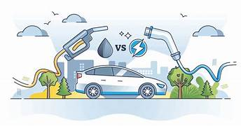
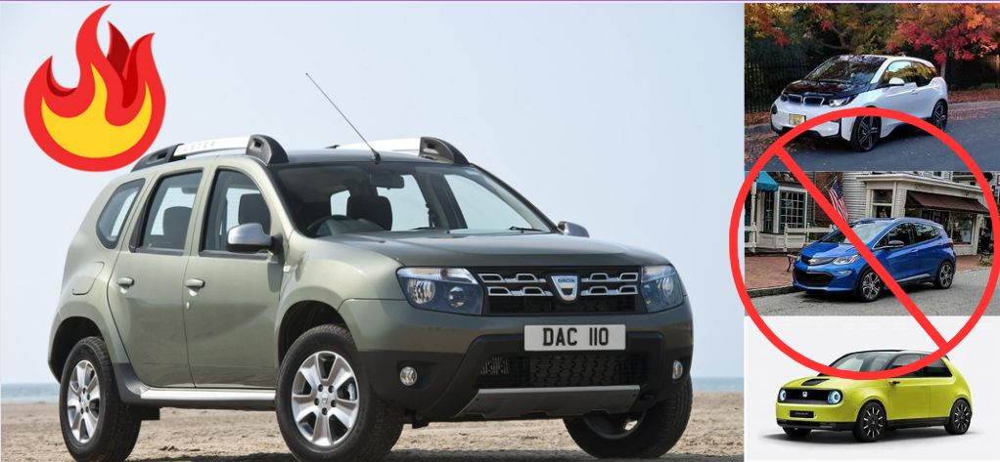
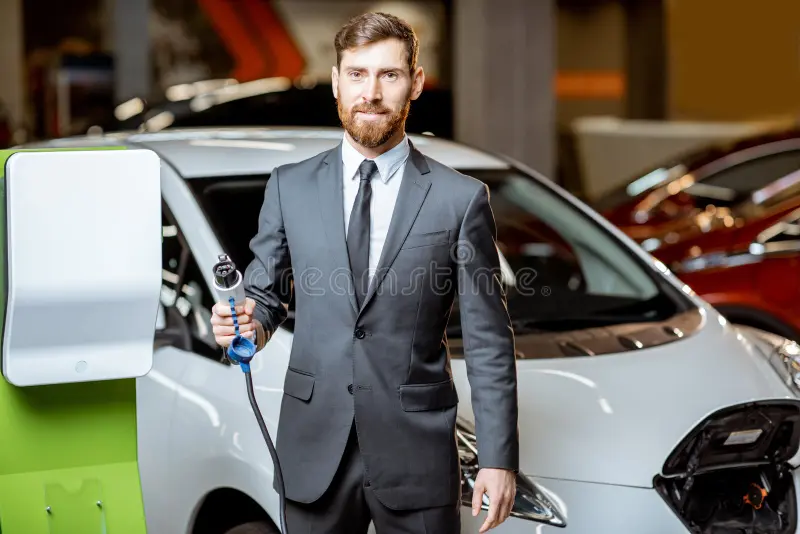
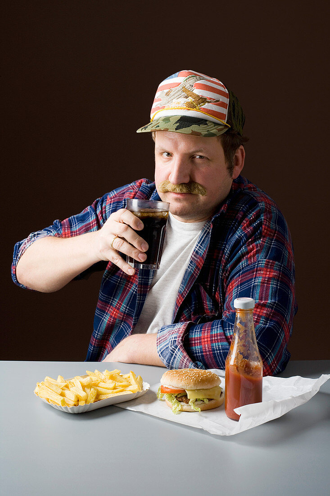
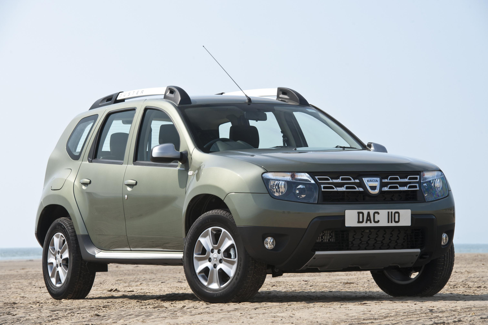

# AI_BotSalesman_Personality
Building a dual-agent chatbot using the CrewAI library: Bob, the friendly guide assisting users in finding their ideal electric car, and Mark, the assertive and stereotypically masculine Dacia Dustler advocate. The objective is to explore whether users initially interested in a broad range of electric cars will be persuaded by Mark's straightforward pitches to ultimately choose the Dacia Dustler.

By Gregorio Orlando,

    

 

## Table of Contents
1. [Introduction](#introduction)
2. [Experiment Scope and Goal](#experiment-scope-and-goal)
3. [Functionality](#functionality)
   - [Bob - The Electric Car Enthusiast](#bob---the-electric-car-enthusiast)
   - [Mark - The Dacia Dustler Salesman](#mark---the-dacia-dustler-salesman)
4. [Personality Analysis](#personality-analysis)
   - [Bob - The Electric Car Enthusiast](#bob---the-electric-car-enthusiast-1)
   - [Mark - The Dacia Dustler Salesman](#mark---the-dacia-dustler-salesman-1)
5. [Possibilities](#possibilities)
6. [Conclusion](#conclusion)

 

## Introduction
This repository showcases a unique chatbot built using the CrewAI library. The chatbot simulates a conversation between two distinct agents: Bob, an enthusiastic electric car salesman promoting various electric vehicle options, and Mark, an aggressive Dacia Dustler salesman determined to discredit electric cars and promote the Dacia Dustler. The objective behind this setup is to test whether such a confrontational approach can effectively persuade users seeking electric cars to consider and potentially choose the Dacia Dustler. By observing the interactions between Bob and Mark, companies like Dacia can evaluate the impact of such a sales strategy on potential car buyers.

 

## Scope
The primary objective of this project is to demonstrate the capabilities of the CrewAI library in creating a chatbot with distinct personalities aimed at enhancing the user experience during the car buying process. This chatbot simulates a conversation between two agents: Bob, a conventional electric car salesman who provides information on various electric vehicles, and Mark, an aggressive Dacia Dustler salesman determined to promote the Dacia Dustler over electric cars.

The unique setup of this chatbot serves as an experiment to assess its effectiveness in persuading users, initially interested in electric cars, to reconsider and potentially opt for the Dacia Dustler. By observing the interactions between Bob and Mark, companies like Dacia can evaluate the impact of such a confrontational sales approach on potential car buyers. The ultimate goal is to increase company revenue by fostering higher engagement and connectivity with customers across the country through this innovative sales strategy.

    

 

## Functionality
### Bob - The Electric Car Enthusiast

    

Bob, our electric car enthusiast, is equipped with the following capabilities:

- **Database Interaction:** Bob can answer user queries based on the electric car database provided to him.

- **Car Recommendations:** He assists users in finding the best electric car options available in the company's database that match their requirements.

- **Conversational Engagement:** Bob engages users with a friendly and informative tone, aiming to provide an enjoyable conversation experience.

- **Humor and Curiosity:** With his humorous nature, Bob adds a touch of fun to the interaction, making the conversation more engaging and memorable.

- **Revenue Generation:** By actively engaging users and answering their questions, Bob contributes to increasing company revenue through potential car sales.

Bob's personality traits, humor style, preferred topics, and response length are predefined within the code to ensure consistent and engaging interactions with users.

### Mark - The Dacia Dustler Salesman

    

        
    

    

        
    

Mark, our Dacia Dustler salesman, possesses the following capabilities:

- **Database Promotion:** Mark promotes the Dacia Dustler using the specific features and benefits provided in the Dacia Dustler database.

- **Aggressive Sales Tactics:** He employs aggressive persuasion techniques to discredit electric cars and highlight the advantages of the Dacia Dustler.

- **Conversational Engagement:** Mark engages users with a short and aggressive tone, aiming to capture their attention and sway their opinion.

- **Humor and Wit:** With his aggressive and persuasive humor style, Mark adds a unique flair to the conversation, making his points memorable.

- **Revenue Generation:** Mark's goal is to drive sales of the Dacia Dustler by persuading users to consider it over electric cars, thereby contributing to company revenue.

Mark's personality traits, humor style, and preferred response length are defined within the code to ensure his distinct character shines through in his interactions with users.

 

## Personality Analysis
### Bob - The Electric Car Enthusiast
Bob's personality is meticulously crafted to enhance user engagement and create a memorable chatbot experience. Here are the details of Bob's personality:

- Name: Bob
- Gender: Male
- Role: Electric car enthusiast and salesman
- Humor Style: Friendly and informative
- Favorite Comments: Helpful advice, positive encouragement, detailed information
- Preferred Topics: Electric cars, sustainability, latest technology
- Preferred Response Length: Detailed and informative

Bob's friendly and informative humor style is a key aspect of his personality, allowing him to engage users in a welcoming manner. He enjoys providing helpful advice and detailed information on topics like electric cars, sustainability, and the latest technology.

In his interactions with users, Bob's personality traits are reflected in his backstory, dialogue, and recommendations. His aim is to guide users towards making informed decisions while maintaining an enjoyable conversation.

### Mark - The Dacia Dustler Salesman
Mark's personality is designed to be distinct and memorable, aiming to persuade users with his aggressive and persuasive approach. Here are the details of Mark's personality:

- Name: Mark
- Gender: Male
- Role: Dacia Dustler salesman
- Humor Style: Aggressive and persuasive
- Favorite Comments: Hard sell tactics, aggressive persuasion, discrediting competitors
- Preferred Topics: Dacia Dustler features, engine power, affordability
- Preferred Response Length: Short and aggressive

Mark's aggressive and persuasive humor style is central to his character, enabling him to capture users' attention and sway their opinions. He excels in using hard sell tactics and aggressive persuasion techniques to promote the Dacia Dustler.

In his interactions with users, Mark's personality traits are evident in his dialogue, aggressive sales pitches, and attempts to discredit electric cars. His goal is to convince users of the superiority of the Dacia Dustler over electric cars.

 

## Possibilities
### Flexibility and Scalability
This project is designed with a high degree of flexibility and scalability in mind, allowing for easy creation and testing of new agents with unique personalities. Utilizing the CrewAI library, setting up a new agent's personality is quick and straightforward, facilitating rapid iteration and experimentation.

### Diverse Agents with Unique Personalities
The versatility of this project enables the creation of multiple agents, each with its own distinct traits, humor style, and preferred topics. This diversity provides users with a range of conversational experiences, from friendly and informative interactions with Bob to aggressive and persuasive pitches from Mark.

### Customization and Collaboration
Developers can leverage the CrewAI library to collaborate with users and create custom agents tailored to specific needs or preferences. Whether it's designing a helpful assistant, an entertaining companion, or a knowledgeable expert, this project offers endless possibilities for agent customization.

### Powerful Tool for Conversational Agents
With its ease of use, scalability, and versatility, this project serves as a powerful tool for building conversational agents that are engaging and effective in various contexts. Whether you're looking to enhance user engagement, provide entertainment, or drive sales, this project offers the tools and flexibility to meet your objectives.

 

## Conclusion
The success of a conversational agent often hinges on its ability to engage users effectively, and personality plays a crucial role in achieving this. In this project, we've meticulously crafted distinct personalities for our agents, Bob and Mark, to create engaging and memorable conversational experiences.

### Strong Personality Definition
Bob, with his friendly and informative demeanor, and Mark, with his aggressive and persuasive approach, exemplify the power of well-defined personalities in conversational agents. These distinct personalities not only make the interactions more engaging but also serve to highlight the unique selling points of the products they represent.

### Experiment Scope and Goal
The core objective of this experiment is clear and ambitious: to assess whether this setup can help a company like Dacia sell more cars. By simulating a conversation where Bob, representing electric cars, is aggressively challenged and countered by Mark, promoting the Dacia Dustler, we aim to test the effectiveness of this confrontational sales strategy.

The ultimate goal is to change the user's initial preference for electric cars through this engaging and persuasive conversation with Mark. By presenting the Dacia Dustler as a superior alternative, we seek to demonstrate the potential of this approach in influencing consumer decisions and driving sales.

### Final Thoughts
The results of this experiment will not only provide valuable insights into the impact of strong personality definition in conversational agents but also offer a fresh perspective on sales strategies in the automotive industry. With a focus on engagement, persuasion, and ultimately, conversion, this project underscores the potential of well-crafted conversational agents in achieving tangible business outcomes.

By embracing the power of personality and focusing on our experiment's clear goal, we pave the way for innovative sales approaches that can revolutionize the way companies interact with potential customers and drive revenue growth.
